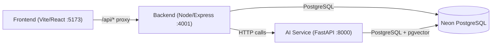

# eRTMAC-NWIS — 3-Tier Integration Plan

## Architecture Overview



The system has **three tiers**: a React frontend, a Node.js backend, and a Python/FastAPI AI service. The frontend talks **only** to the backend via `/api/*`, and the backend proxies AI-related requests to the Python service. Both backend and AI service share the same PostgreSQL database.

---

## 🔍 Findings Summary

After a thorough codebase audit, the integration is **mostly well-wired** — the backend already has an [AI client](file:///c:/Users/amanm/Desktop/New%20folder/sih%202nd%20oil%20well%20-%20Copy/eRTMAC-NWIS-Final/Wells/nwis-backend/src/config/ai.js) with circuit-breaker logic that delegates to the Python service, and the Python service already exposes dual endpoints (both its native paths and compatibility aliases). However, there are several **mismatches and gaps** that will prevent things from working correctly.

---

## 🚨 Issues Found & Fixes Required

### Phase 1: Endpoint & Contract Mismatches (Critical)

#### Issue 1.1: Document Ingestion API Mismatch
| Layer | What it does | Problem |
|-------|-------------|---------|
| Backend [ai.service.js:20](file:///c:/Users/amanm/Desktop/New%20folder/sih%202nd%20oil%20well%20-%20Copy/eRTMAC-NWIS-Final/Wells/nwis-backend/src/services/ai.service.js#L20) | Calls `aiClient.ocr.processDocument()` | The `aiClient` object in [ai.js](file:///c:/Users/amanm/Desktop/New%20folder/sih%202nd%20oil%20well%20-%20Copy/eRTMAC-NWIS-Final/Wells/nwis-backend/src/config/ai.js) has **no `ocr` property** — it has `processDocument(documentId, filePath, wellId)` |
| Backend [ai.js:231](file:///c:/Users/amanm/Desktop/New%20folder/sih%202nd%20oil%20well%20-%20Copy/eRTMAC-NWIS-Final/Wells/nwis-backend/src/config/ai.js#L231) | Sends `POST /api/documents/process` with `{ document_id, file_path, well_id }` as JSON | AI service's [ingest.py](file:///c:/Users/amanm/Desktop/New%20folder/sih%202nd%20oil%20well%20-%20Copy/final%20ai/ai_service/app/routers/ingest.py) expects **multipart form data** with a `file` field (UploadFile), plus `well_id` and `doc_type` as Form fields |
| AI service [ingest.py:16](file:///c:/Users/amanm/Desktop/New%20folder/sih%202nd%20oil%20well%20-%20Copy/final%20ai/ai_service/app/routers/ingest.py#L16) | Exposes `POST /documents/ingest` and `POST /api/documents/process` | Expects actual file upload, not a JSON body with a file path |

**Fix:** 
- Rewrite `ai.service.js` → `processDocument()` to stop calling `aiClient.ocr.processDocument()` (doesn't exist) and instead call `aiClient.processDocument()` correctly.
- Rewrite `aiClient.processDocument()` in `ai.js` to send multipart/form-data with the actual file buffer to `/documents/ingest`, instead of sending JSON with a file path.
- Update [documentIngestion.job.js](file:///c:/Users/amanm/Desktop/New%20folder/sih%202nd%20oil%20well%20-%20Copy/eRTMAC-NWIS-Final/Wells/nwis-backend/src/jobs/documentIngestion.job.js) to pass file buffer/path properly.

#### Issue 1.2: Embedding Generation API Mismatch
| Layer | What it does | Problem |
|-------|-------------|---------|
| Backend [ai.service.js:43](file:///c:/Users/amanm/Desktop/New%20folder/sih%202nd%20oil%20well%20-%20Copy/eRTMAC-NWIS-Final/Wells/nwis-backend/src/services/ai.service.js#L43) | Calls `aiClient.embeddings.batchGenerate()` | The `aiClient` object has **no `embeddings` property** — no such method exists |

**Fix:**
- The AI service handles embeddings internally during ingestion (inside `ingest_pdf`). The backend should **not** attempt separate embedding generation — remove the `generateEmbeddings` method from `ai.service.js` or make it a no-op. Embeddings are created by the Python service during document ingestion.

#### Issue 1.3: Risk Evaluate Response Shape Mismatch
| Layer | Expected | Actual |
|-------|----------|--------|
| Backend [risk.service.js:281](file:///c:/Users/amanm/Desktop/New%20folder/sih%202nd%20oil%20well%20-%20Copy/eRTMAC-NWIS-Final/Wells/nwis-backend/src/services/risk.service.js#L281) | Expects `aiResult.data.alerts` or `aiResult.data.risks` as an array of `{ risk_type, score, risk_level, depth_range, evidence, reasons, score_breakdown, rule_version }` | AI service [risk.py:67](file:///c:/Users/amanm/Desktop/New%20folder/sih%202nd%20oil%20well%20-%20Copy/final%20ai/ai_service/app/routers/risk.py#L67) returns `{ well_id, depth, formation, alerts: [...] }` where each alert has `{ risk_type, score, risk_level, reasons, evidence, depth_range, rule_version }` |

**Status:** ✅ The backend reads `aiResult.data.alerts || aiResult.data.risks`, and the AI returns `alerts` — this should work. However, the score from AI is 0–100, and the backend in [risk.service.js:291](file:///c:/Users/amanm/Desktop/New%20folder/sih%202nd%20oil%20well%20-%20Copy/eRTMAC-NWIS-Final/Wells/nwis-backend/src/services/risk.service.js#L291) divides by 100 (`(alert.score || 50) / 100`). Need to verify the AI engine returns scores in 0–100 range.

**Fix:** Verify and align the score scale in the Python [risk engine](file:///c:/Users/amanm/Desktop/New%20folder/sih%202nd%20oil%20well%20-%20Copy/final%20ai/ai_service/app/risk/engine.py). If it returns 0–1 floats, the backend division by 100 will produce near-zero scores.

#### Issue 1.4: Similarity Response Shape Verification
| Layer | Expected | Actual |
|-------|----------|--------|
| Backend [similarity.service.js:49](file:///c:/Users/amanm/Desktop/New%20folder/sih%202nd%20oil%20well%20-%20Copy/eRTMAC-NWIS-Final/Wells/nwis-backend/src/services/similarity.service.js#L49) | `aiResult.data.results` or `aiResult.data.similar_wells` | AI [similar.py:66](file:///c:/Users/amanm/Desktop/New%20folder/sih%202nd%20oil%20well%20-%20Copy/final%20ai/ai_service/app/routers/similar.py#L66) returns `{ well_id, results: [...], similar_wells: [...] }` |

**Status:** ✅ Compatible — the AI returns both `results` and `similar_wells`. But need to verify the shape of each result object (does it have `well_id`, `well_name`, `distance_km`, `score`, `factors`?).

**Fix:** Read [similarity/engine.py](file:///c:/Users/amanm/Desktop/New%20folder/sih%202nd%20oil%20well%20-%20Copy/final%20ai/ai_service/app/similarity/engine.py) and verify the returned object shape matches what the backend expects at lines 55–69 of `similarity.service.js`.

---

### Phase 2: Frontend → Backend Route Mismatches

#### Issue 2.1: Risk Evaluate Endpoint Mismatch
| Layer | Calls | Backend Route |
|-------|-------|---------------|
| Frontend [client.js:144](file:///c:/Users/amanm/Desktop/New%20folder/sih%202nd%20oil%20well%20-%20Copy/eRTMAC-NWIS-Final/Wells/nwis-frontend/src/api/client.js#L144) | `POST /api/risks/evaluate` with `{ well_id, depth }` | Backend [risk.routes.js:13](file:///c:/Users/amanm/Desktop/New%20folder/sih%202nd%20oil%20well%20-%20Copy/eRTMAC-NWIS-Final/Wells/nwis-backend/src/routes/risk.routes.js#L13) has `POST /api/risks/evaluate` ✅ |

**Status:** ✅ This matches.

#### Issue 2.2: Similarity Endpoint Mismatch
| Layer | Calls | Backend Route |
|-------|-------|---------------|
| Frontend [client.js:139](file:///c:/Users/amanm/Desktop/New%20folder/sih%202nd%20oil%20well%20-%20Copy/eRTMAC-NWIS-Final/Wells/nwis-frontend/src/api/client.js#L139) | `GET /api/similarity/{wellId}` | Backend [similarity.routes.js:13](file:///c:/Users/amanm/Desktop/New%20folder/sih%202nd%20oil%20well%20-%20Copy/eRTMAC-NWIS-Final/Wells/nwis-backend/src/routes/similarity.routes.js#L13) has `GET /api/similarity/:wellId` ✅ |

**Status:** ✅ This matches.

#### Issue 2.3: Search Vector Endpoint
| Layer | Calls | Backend Route |
|-------|-------|---------------|
| Frontend [client.js:127](file:///c:/Users/amanm/Desktop/New%20folder/sih%202nd%20oil%20well%20-%20Copy/eRTMAC-NWIS-Final/Wells/nwis-frontend/src/api/client.js#L127) | `POST /api/search/vector` | Backend [search.routes.js:19](file:///c:/Users/amanm/Desktop/New%20folder/sih%202nd%20oil%20well%20-%20Copy/eRTMAC-NWIS-Final/Wells/nwis-backend/src/routes/search.routes.js#L19) has `POST /api/search/vector` ✅ |

**Status:** ✅ This matches.

#### Issue 2.4: Realtime SSE URL Construction Bug
| Layer | Problem |
|-------|---------|
| Frontend [useWellRealtime.js:14](file:///c:/Users/amanm/Desktop/New%20folder/sih%202nd%20oil%20well%20-%20Copy/eRTMAC-NWIS-Final/Wells/nwis-frontend/src/hooks/useWellRealtime.js#L14) | Uses `api.defaults.baseURL` which is `'/api'`, producing SSE URL `/api/realtime/{wellId}`. But EventSource doesn't go through Vite's proxy — it goes to `http://localhost:5173/api/realtime/...`. Vite proxy only applies to `fetch`/`XMLHttpRequest`, **not native EventSource**. |

**Fix:** The EventSource URL must point directly to the backend: `http://localhost:4001/api/realtime/{wellId}`. Construct the SSE URL using the backend host, or configure the Vite proxy to handle SSE (which it can, but the baseURL resolution is wrong since `/api` is relative).

> **Actually**, looking again, the Vite dev server proxy **does** handle EventSource because it proxies all requests to `/api/*` at the HTTP level. The `EventSource('/api/realtime/...')` should work correctly through the Vite proxy. But the code at line 14 falls back to `'http://localhost:3000/api'` — **port 3000 is wrong** (backend is on 4001). This fallback is only used if `api.defaults.baseURL` is undefined, but since it's set to `'/api'`, the relative path should work via Vite proxy.

**Fix:** Change the fallback from port 3000 to port 4001 in `useWellRealtime.js` line 14.

---

### Phase 3: Database & Connection Issues

#### Issue 3.1: Database URL SSL Parameter Difference
| Service | DATABASE_URL `sslmode` param |
|---------|------------------------------|
| Backend [.env:6](file:///c:/Users/amanm/Desktop/New%20folder/sih%202nd%20oil%20well%20-%20Copy/eRTMAC-NWIS-Final/Wells/nwis-backend/.env#L6) | `sslmode=require&channel_binding=require&uselibpqcompat=true` |
| AI [.env:1](file:///c:/Users/amanm/Desktop/New%20folder/sih%202nd%20oil%20well%20-%20Copy/final%20ai/ai_service/.env#L1) | `sslmode=require&channel_binding=require` (no `uselibpqcompat`) |

**Status:** ⚠️ Minor — both connect to the same Neon DB. The `uselibpqcompat` param is specific to the Node `pg` driver and shouldn't be passed to Python's `psycopg`. This is fine as-is.

#### Issue 3.2: AI Service Database Connection Uses `psycopg` with pgvector
The AI service uses `psycopg` (v3) with `pgvector.psycopg`. Ensure the Neon database has the `vector` extension enabled:
```sql
CREATE EXTENSION IF NOT EXISTS vector;
```

---

### Phase 4: WebSocket vs SSE Realtime Architecture Conflict

#### Issue 4.1: Two Different Realtime Systems
| Component | Technology | Port |
|-----------|-----------|------|
| Backend [realtime.controller.js](file:///c:/Users/amanm/Desktop/New%20folder/sih%202nd%20oil%20well%20-%20Copy/eRTMAC-NWIS-Final/Wells/nwis-backend/src/controllers/realtime.controller.js) | **SSE (Server-Sent Events)** via Express | 4001 |
| AI service [realtime.py](file:///c:/Users/amanm/Desktop/New%20folder/sih%202nd%20oil%20well%20-%20Copy/final%20ai/ai_service/app/routers/realtime.py) | **WebSocket** via FastAPI | 8000 |
| Frontend [useWellRealtime.js](file:///c:/Users/amanm/Desktop/New%20folder/sih%202nd%20oil%20well%20-%20Copy/eRTMAC-NWIS-Final/Wells/nwis-frontend/src/hooks/useWellRealtime.js) | **EventSource (SSE)** | Proxied via 5173→4001 |

**Problem:** The AI service has a WebSocket-based realtime replay with integrated risk evaluation (`/realtime/{well_id}`), while the backend has its own SSE-based system. The frontend currently connects to the **backend SSE** endpoint. The AI service's WebSocket endpoint (which runs actual risk evaluation in real-time using its ML models) is **not being used by anyone**.

**Fix:** Two options:
1. **(Recommended)** Keep the frontend using backend SSE. Make the backend's replay service connect to the AI service's WebSocket internally and relay data through its SSE stream. This keeps the frontend unchanged and routes AI risk evaluations through the existing pipeline.
2. Add a WebSocket client to the frontend for connecting directly to the AI service for replay scenarios.

---

### Phase 5: Missing AI Features in Frontend

#### Issue 5.1: No ML Model Predictions UI
The AI service has an experimental ML endpoint at `GET /ml/risk/{well_id}?depth=...&event_type=...&explain=true` ([ml.py](file:///c:/Users/amanm/Desktop/New%20folder/sih%202nd%20oil%20well%20-%20Copy/final%20ai/ai_service/app/routers/ml.py)) that returns ML model probability predictions with SHAP explanations. **The frontend has no UI for this.** The backend has no proxy route for this either.

**Fix:**
- Add a backend proxy route `GET /api/ml/risk/:wellId` that forwards to the AI service.
- Add a frontend API method and UI component (e.g., on the RisksPage or RealtimePage) to display ML probability predictions.

#### Issue 5.2: Document Entities Endpoint Not Fully Wired
The AI service has `GET /documents/{document_id}/entities` ([documents.py](file:///c:/Users/amanm/Desktop/New%20folder/sih%202nd%20oil%20well%20-%20Copy/final%20ai/ai_service/app/routers/documents.py)). The backend has its own entity endpoint through the DB. The frontend calls `GET /api/documents/:id/entities` which hits the **backend**'s entity endpoint (reads from DB), not the AI service's. This is fine if ingestion populates the DB properly — but it currently doesn't work because of Issue 1.1.

**Fix:** Fixing Issue 1.1 (document ingestion) will cascade-fix this.

#### Issue 5.3: No Trained ML Models Exist
The [ml/models/](file:///c:/Users/amanm/Desktop/New%20folder/sih%202nd%20oil%20well%20-%20Copy/final%20ai/ai_service/ml/models) directory is **empty**. The `/ml/risk` endpoint requires trained `.joblib` model files.

**Fix:** Run the training pipeline:
```bash
cd "final ai/ai_service"
python ml/train.py --event mud_loss
```
This requires the synthetic data in [`data/synthetic/`](file:///c:/Users/amanm/Desktop/New%20folder/sih%202nd%20oil%20well%20-%20Copy/final%20ai/data/synthetic) to be present (it is).

---

### Phase 6: Configuration & Startup Issues

#### Issue 6.1: AI Service Port Alignment  
Backend `.env` sets `AI_SERVICE_URL=http://localhost:8000`. AI service starts on port 8000 via `uvicorn ... --port 8000`. ✅ This matches.

#### Issue 6.2: Backend `.env` S3 Storage — MinIO Not Running
The backend expects MinIO at `http://localhost:9000` for document storage. If MinIO isn't running, document upload will fail with a storage error.

**Fix:** Either:
1. Start MinIO via Docker: `docker run -p 9000:9000 minio/minio server /data`
2. Or modify [storage.js](file:///c:/Users/amanm/Desktop/New%20folder/sih%202nd%20oil%20well%20-%20Copy/eRTMAC-NWIS-Final/Wells/nwis-backend/src/config/storage.js) to use local filesystem storage (check if it already has fallback).

#### Issue 6.3: Missing Python Virtual Environment
The AI service expects `.venv` to exist in `final ai/ai_service/`. If it hasn't been set up:
```bash
cd "final ai/ai_service"
python -m venv .venv
.venv\Scripts\activate
pip install -r requirements.txt
```

---

## 📋 Implementation Plan (Ordered by Priority)

### Step 1: Fix Document Ingestion Pipeline (Issues 1.1, 1.2)
**Files to modify:**
- [ai.js](file:///c:/Users/amanm/Desktop/New%20folder/sih%202nd%20oil%20well%20-%20Copy/eRTMAC-NWIS-Final/Wells/nwis-backend/src/config/ai.js) — Rewrite `processDocument()` to send multipart form-data
- [ai.service.js](file:///c:/Users/amanm/Desktop/New%20folder/sih%202nd%20oil%20well%20-%20Copy/eRTMAC-NWIS-Final/Wells/nwis-backend/src/services/ai.service.js) — Fix `processDocument()` to call `aiClient.processDocument()` correctly, remove `generateEmbeddings()`
- [documentIngestion.job.js](file:///c:/Users/amanm/Desktop/New%20folder/sih%202nd%20oil%20well%20-%20Copy/eRTMAC-NWIS-Final/Wells/nwis-backend/src/jobs/documentIngestion.job.js) — Pass file buffer to AI service

### Step 2: Verify Risk Score Scale (Issue 1.3)
**Files to check:**
- [risk/engine.py](file:///c:/Users/amanm/Desktop/New%20folder/sih%202nd%20oil%20well%20-%20Copy/final%20ai/ai_service/app/risk/engine.py) — Check if scores are 0–1 or 0–100
- [risk.service.js](file:///c:/Users/amanm/Desktop/New%20folder/sih%202nd%20oil%20well%20-%20Copy/eRTMAC-NWIS-Final/Wells/nwis-backend/src/services/risk.service.js) — Adjust the `/100` division if needed

### Step 3: Verify Similarity Response Shape (Issue 1.4)
**Files to check:**
- [similarity/engine.py](file:///c:/Users/amanm/Desktop/New%20folder/sih%202nd%20oil%20well%20-%20Copy/final%20ai/ai_service/app/similarity/engine.py) — Verify returned object fields

### Step 4: Fix Realtime SSE Fallback Port (Issue 2.4)
**File to modify:**
- [useWellRealtime.js](file:///c:/Users/amanm/Desktop/New%20folder/sih%202nd%20oil%20well%20-%20Copy/eRTMAC-NWIS-Final/Wells/nwis-frontend/src/hooks/useWellRealtime.js) — Change fallback port from 3000 to 4001

### Step 5: Add ML Predictions Proxy & Frontend (Issue 5.1)
**Files to create/modify:**
- Backend: Add new route `ml.routes.js` and controller to proxy `GET /api/ml/risk/:wellId` → AI `GET /ml/risk/:wellId`
- Backend: Add `mlPredict()` method to `ai.js` client
- Backend: Register route in `routes/index.js`
- Frontend: Add `mlAPI` to `client.js`
- Frontend: Add ML prediction panel to the Realtime or Risks page

### Step 6: Train ML Models (Issue 5.3)
- Run `python ml/train.py --event mud_loss` to produce the required `.joblib` files

### Step 7: Wire AI WebSocket Replay into Backend SSE (Issue 4.1)
**Files to modify:**
- [replay.service.js](file:///c:/Users/amanm/Desktop/New%20folder/sih%202nd%20oil%20well%20-%20Copy/eRTMAC-NWIS-Final/Wells/nwis-backend/src/services/replay.service.js) — When in replay mode, open a WebSocket client to `ws://localhost:8000/realtime/{wellId}` and relay each message as SSE events

### Step 8: Storage Fallback (Issue 6.2)
**File to check/modify:**
- [storage.js](file:///c:/Users/amanm/Desktop/New%20folder/sih%202nd%20oil%20well%20-%20Copy/eRTMAC-NWIS-Final/Wells/nwis-backend/src/config/storage.js) — Ensure local file storage works without MinIO

---

## ✅ What's Already Working Correctly

| Feature | Frontend → Backend → AI | Status |
|---------|------------------------|--------|
| RAG/Assistant Chat | `POST /api/assistant/query` → `POST /assistant/query` | ✅ Wired end-to-end |
| Risk Evaluation | `POST /api/risks/evaluate` → `POST /api/risk/evaluate` | ✅ Wired (score scale needs verification) |
| Similarity | `GET /api/similarity/:id` → `POST /api/similarity/compute` | ✅ Wired (shape needs verification) |
| Vector Search | `POST /api/search/vector` → `POST /search` | ✅ Wired end-to-end |
| AI Health Check | `GET /api/health` → `GET /health` | ✅ Wired |
| Auth & JWT | `POST /api/auth/login` | ✅ No AI involvement |
| Wells CRUD | `GET/POST /api/wells` | ✅ No AI involvement |
| Dashboard | `GET /api/dashboard/:id` | ✅ No AI involvement |
| SSE Realtime | `GET /api/realtime/:id` | ✅ Works (backend only, no AI replay) |

---

> [!IMPORTANT]
> The most critical fix is **Step 1** (Document Ingestion). The `ai.service.js` references methods that don't exist on the `aiClient` object (`aiClient.ocr.processDocument()` and `aiClient.embeddings.batchGenerate()`). These will crash at runtime. The second most impactful fix is verifying the risk score scale (Step 2) since wrong scores propagate to every risk-related UI.

Shall I proceed with implementing these fixes?
